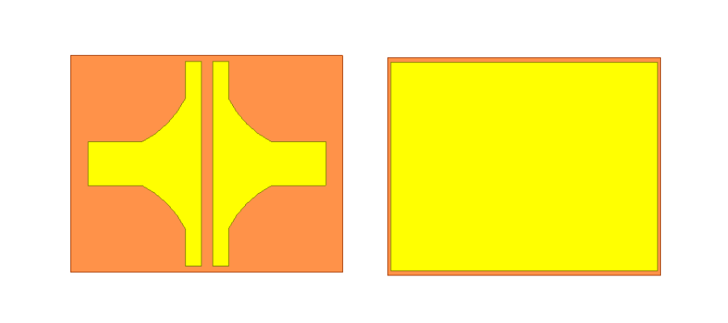
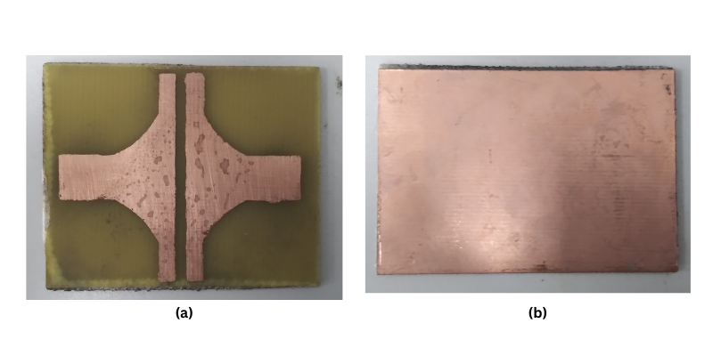

# Metasurface-Based RF Energy Harvester for 2.6 GHz Wireless Power Transfer

Design, simulation, fabrication, and experimental validation of a split-ring resonator (SRR) metasurface absorber for RF energy harvesting at 2.6 GHz — a frequency band shared by LTE/cellular and Wi-Fi networks.

## Overview

This project addresses a core challenge in wireless power transfer (WPT) and RF energy harvesting (WEH): efficiently capturing ambient RF energy at a specific target frequency to power low-power IoT and sensor devices without batteries.

A modified split-ring resonator unit cell was designed in **Ansys HFSS**, fabricated on double-sided **FR-4** substrate using standard PCB etching, and validated experimentally using a **non-contact S₁₁ measurement technique** with a copper ring antenna and a **Rigol RSA3030N** spectrum analyser operating in VNA mode. The design was scaled from a single unit cell to **2×2 and 3×3 array configurations** to assess consistency and scalability.

## Key Results

| Metric | Simulated | Measured |
|---|---|---|
| Resonant frequency | 2.6 GHz | ~2.6 GHz (slight shift) |
| Reflection coefficient (S₁₁) | −26.77 dB | Pronounced dip confirmed |
| Absorption | 98.7% | 94.2% |
| Array scalability | 2×2 and 3×3 tested | Resonance preserved, minor shifts |

Strong agreement between simulation and measurement confirmed near-perfect absorption at the resonant frequency, and performance was maintained when scaling from unit cell to array configurations, with minor shifts attributed to mutual coupling between elements.

## Methodology

1. **Design & Simulation** — Modified SRR unit cell modelled in Ansys HFSS; S₁₁, S₂₁, and surface current distributions analysed to characterise resonance and coupling behaviour.

  

3. **Fabrication** — Thermal transfer and chemical etching of copper-clad FR-4 to produce unit cell, 2×2, and 3×3 array samples.

  

4. **Experimental Validation** — Non-contact S₁₁ measurement using a copper ring antenna as RF source, captured with a Rigol RSA3030N spectrum/network analyser in VNA mode.

  

5. **Comparison & Analysis** — Simulated vs. measured S₁₁ compared across all configurations to validate design consistency and scalability.

## Relevance to RF Test Engineering

This project involved hands-on work across the full RF characterisation workflow, directly applicable to an RF Test Engineer role:

- **RF measurement & instrumentation** — Operated a spectrum/network analyser (Rigol RSA3030N) in VNA mode to perform S-parameter (S₁₁) measurements, including designing a non-contact test fixture (copper ring antenna coupling).
- **EM simulation & modelling** — Used Ansys HFSS for full-wave electromagnetic simulation, S-parameter extraction, and surface current analysis to predict device behaviour before fabrication.
- **Correlating simulation vs. measured data** — Directly compared simulated and measured S₁₁ across multiple sample configurations, a core RF test/validation skill (identifying deviations, resonance shifts, and mutual coupling effects).
- **PCB fabrication** — Practical experience translating a simulated design into a physical prototype via etching on FR-4 substrate, informing test-for-manufacturability considerations.
- **Design of Experiments / Scalability testing** — Tested unit cell, 2×2, and 3×3 arrays to characterise how performance scales and where deviations from simulation emerge — analogous to test-plan design across product variants.
- **Frequency band awareness** — Worked specifically at 2.6 GHz (cellular/LTE band), relevant to RF/wireless test roles involving cellular, Wi-Fi, or IoT device validation.

